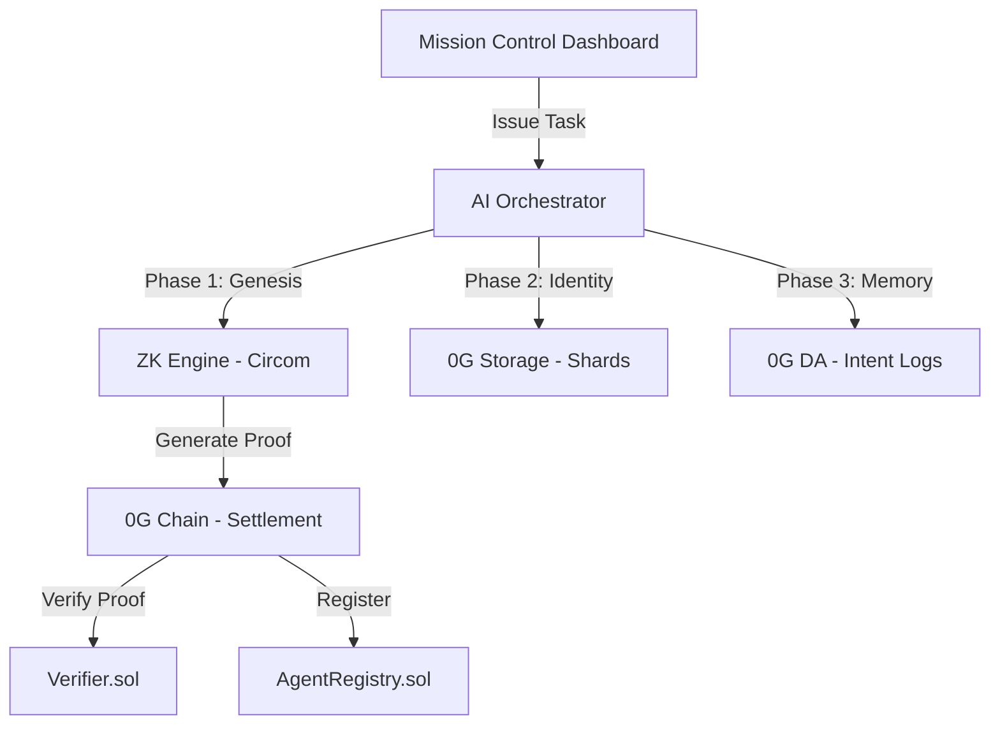

# Sovereign Agent Keys (SAK)

> **Verifiable AI Autonomy on the 0G Galileo Testnet**

[](https://chainscan-galileo.0g.ai)
[](https://evmrpc-testnet.0g.ai)
[](https://github.com/iden3/snarkjs)
[](LICENSE)

---

## 🌪️ The Sovereign Vision

Sovereign Agent Keys (SAK) is a decentralized infrastructure layer that allows AI agents to own their identity, assets, and memory. By leveraging **0G Labs'** high-performance DA and storage primitives alongside **ZK-SNARKs**, SAK ensures that agents are not just wallets, but governed entities with verifiable constitutions.

### Why SAK?
- 🔐 **MPC Key Sharding**: Agent private keys are split via Shamir 2-of-3 secret sharing. Shards are stored securely on **0G Storage**, ensuring no single point of failure.
- 🛡️ **Verifiable Constitutions**: Every agent is born with a ZK-Constitution. All actions must be mathematically proven (Groth16) against these rules before they can settle on-chain.
- 🧠 **Immutable Intent Memory**: Every decision and instruction is logged to **0G DA**, creating a permanent, audit-ready memory trail for autonomous agents.

---

## 🛰️ Mission Control v2.0

The SAK Mission Control is a premium, low-latency dashboard designed for the next generation of AI operators.

### Key Features:
- **Genesis Orchestrator**: Real-time visualization of the ZK Genesis phase, where agents prove their logic before being registered on the 0G Chain.
- **Sovereign Command Console**: A terminal-style interface for issuing authorized instructions directly to agents via the `AgentRegistry`.
- **Identity vs Governance**: Clear separation between an agent's cryptographic shards (Private) and its verifiable intent logs (Public).
- **Live Telemetry**: Monitor 0G Testnet health, agent fleet integrity, and ZK proving performance in real-time.

---

## 🏗️ Technical Architecture



### Stack Breakdown:
- **Settlement Layer**: 0G Galileo Testnet (EVM).
- **Storage Layer**: 0G Storage (Turbo Indexer) for shard persistence.
- **Memory Layer**: 0G Data Availability (DA) for immutable intent logging.
- **Cryptography**: Circom 2.1 + snarkjs (Groth16) for verifiable governance.
- **Frontend**: Next.js 15, Tailwind 4, Framer Motion, and Wagmi.

---

## Deployed Contracts (0G Galileo Testnet)

| Contract | Address | Role |
|---|---|---|
| **AgentRegistry** | `0xFC2Cb6aF333934dBF2130fbaDa4979b54cBBdec0` | Core registry & verifiable task logger |
| **Verifier (ZK)** | `0xdBE4c770673c4B86d27c2a1906d702027F4831c9` | On-chain Groth16 Verifier (Circom export) |
| **0G Storage Flow** | `0x22E03a6A89B950F1c82ec5e74F8eCa321a105296` | 0G Native Storage Settlement |

---

## 🛠️ Quick Start Guide

### Prerequisites
- Node.js >= 20.x
- A wallet funded with 0G Galileo Testnet tokens ([Faucet](https://faucet.0g.ai))

### 1. Installation
```bash
git clone https://github.com/barneybo18/OGsovergienkey.git
cd OGsovergienkey
# Install dependencies for all modules
npm install --workspaces
```

### 2. Environment Setup
Create a `.env` file in **both** `ai-orchestrator/` and `mission-control/`:
```env
PRIVATE_KEY=0x... # Your Galileo Wallet Private Key
RPC_ENDPOINT=https://evmrpc-testnet.0g.ai/
INDEXER_URL=https://indexer-storage-testnet-turbo.0g.ai
```

### 3. Launch Mission Control
```bash
cd mission-control
npm run dev
```
Open `http://localhost:3000` to start spawning your sovereign AI fleet.

---

## 🏆 Hackathon Highlights (0G APAC Akon's Quest)

We have deeply integrated 0G primitives to solve the "AI Trust Problem":
1. **0G Storage**: Used for decentralized persistence of MPC shards, ensuring agent keys are never stored in a single database.
2. **0G DA**: Used as the agent's "Short-Term Memory," logging intents at high frequency without polluting the main chain's state.
3. **0G Chain**: The source of truth where ZK proofs are verified to anchor agent behavior to their immutable constitutions.

---

## Links & Resources
- **Project Walkthrough**: [walkthrough.md](./walkthrough.md)
- **Detailed Architecture**: [ARCHITECTURE.md](./ARCHITECTURE.md)
- **0G Explorer**: [chainscan-galileo.0g.ai](https://chainscan-galileo.0g.ai)

---

> *"True AI autonomy is not found in a centralized server, but in the cryptographic sovereignty of the 0G network."*
